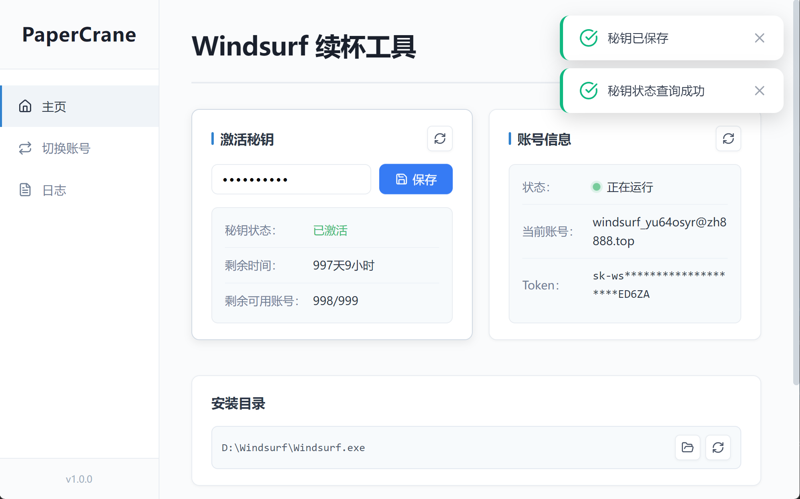
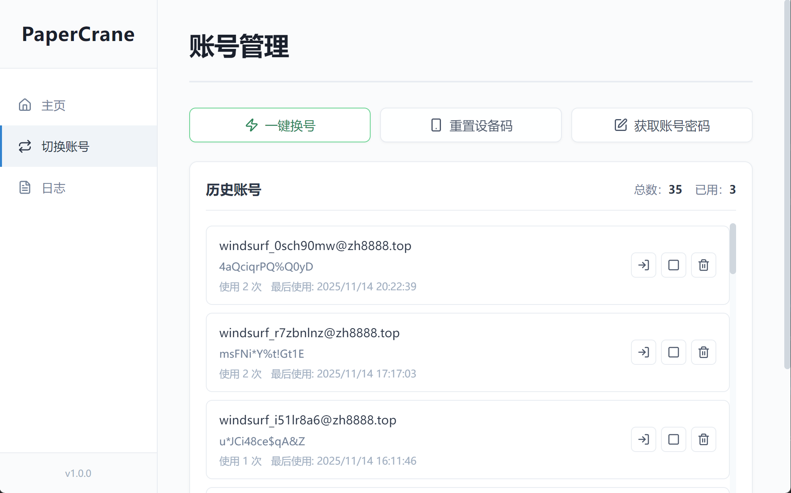

# PaperCrane-Windsurf Client

Windsurf 账号一键切换工具，支持 Windows 与 macOS。

一个基于 Electron 的桌面端客户端，配合 [Account-Secret-Key-Management](https://github.com/ZH0531/Account-Secret-Key-Management) 后端使用，实现 Windsurf 账号的快速切换和设备指纹重置。

## 🔥 系统截图

### 主界面


### 账号管理


## ✨ 功能特性

### 🔑 秘钥管理
- **激活秘钥**：输入后端分配的 API 秘钥
- **查询状态**：实时查看秘钥剩余时间和使用次数
- **本地存储**：秘钥自动保存，无需重复输入

### 💻 账号管理
- **一键获取**：从后端自动获取可用账号
- **账号切换**：快速切换已保存的账号
- **历史记录**：查看所有使用过的账号
- **账号删除**：清理不需要的账号

### 🔄 设备管理
- **指纹重置**：重置 Windsurf 设备指纹以解决设备限制
- **自动检测**：自动检测 Windsurf 进程状态
- **安全提示**：操作前提示关闭 Windsurf

### 🛡️ 安全特性
- **数据加密**：账号信息本地加密存储
- **管理员权限**：自动检测并请求管理员权限（Windows）
- **数据隔离**：各账号数据独立存储

## 📥 下载与安装

### 从 Releases 下载

到 [Releases](https://github.com/ZH0531/Windsurf-tool/releases) 获取最新安装包。

**Windows**
- `PaperCrane-Windsurf Setup x.x.x.exe` - 安装版（推荐）
- `PaperCrane-Windsurf x.x.x.exe` - 便携版

**macOS**
- `PaperCrane-Windsurf-x.x.x.dmg` - 安装包
- `PaperCrane-Windsurf-x.x.x-mac.zip` - 压缩包

**Linux**
- `PaperCrane-Windsurf-x.x.x.AppImage` - AppImage 格式
- `PaperCrane-Windsurf_x.x.x_amd64.deb` - Debian/Ubuntu 包

### 配置后端地址

首次使用前，需要配置后端 API 地址：

1. 打开 `modules/keyManager.js`
2. 修改 `API_CONFIG.BASE_URL`：
```javascript
const API_CONFIG = {
  BASE_URL: 'https://your-domain.com/api/client',  // 修改为你的后端地址
  TIMEOUT: 10000
};
```

## 🚀 快速开始

### 1. 输入秘钥
- 启动客户端
- 点击"设置秘钥"
- 输入从后端管理员获取的 API 秘钥

### 2. 获取账号
- 点击"获取新账号"
- 系统从后端自动分配账号
- 账号信息会自动保存

### 3. 切换账号
- 在账号列表中选择账号
- 点击"切换账号"
- 系统会自动：
  - 关闭 Windsurf（如果正在运行）
  - 重置设备指纹
  - 应用账号配置
  - 重新启动 Windsurf

## 🛠️ 开发调试

### 安装依赖
```bash
npm install
```

### 启动开发模式
```bash
npm start
```

### 本地打包
```bash
npm run build:win   # Windows
npm run build:mac   # macOS
npm run build:linux # Linux
```

## 📂 项目结构

```
PaperCrane-Windsurf/
├── main.js                 # Electron 主进程
├── preload.js             # 预加载脚本
├── renderer/              # 渲染进程（UI）
│   ├── index.html        # 主界面
│   ├── style.css         # 样式文件
│   └── renderer.js       # 前端逻辑
├── modules/              # 核心模块
│   ├── keyManager.js     # 秘钥管理
│   ├── deviceManager.js  # 设备管理
│   ├── configManager.js  # 配置管理
│   ├── sessionManager.js # 会话管理
│   ├── secureStorageManager.js  # 安全存储
│   ├── accountHistoryManager.js # 账号历史
│   ├── processMonitor.js        # 进程监控
│   └── fingerprintResetter.js   # 指纹重置
└── package.json          # 项目配置
```

## 🔧 配置说明

### API 配置
编辑 `modules/keyManager.js`：
```javascript
const API_CONFIG = {
  BASE_URL: 'https://your-domain.com/api/client',
  TIMEOUT: 10000  // 请求超时时间（毫秒）
};
```

### Windsurf 路径配置
程序会自动检测 Windsurf 安装路径，如需手动配置：
- **Windows**: `%LOCALAPPDATA%\Programs\windsurf\Windsurf.exe`
- **macOS**: `/Applications/Windsurf.app`

## ⚠️ 注意事项

1. **管理员权限**（Windows）
   - 修改设备指纹需要管理员权限
   - 程序会自动请求权限提升

2. **关闭 Windsurf**
   - 切换账号前请确保 Windsurf 已关闭
   - 程序会自动检测并提示

3. **数据备份**
   - 账号数据存储在本地应用数据目录
   - 建议定期备份重要账号信息

4. **秘钥安全**
   - 妥善保管 API 秘钥
   - 不要分享给未授权用户

## 🤝 配合使用

本客户端需要配合后端使用：
- **后端项目**: [Account-Secret-Key-Management](https://github.com/ZH0531/Account-Secret-Key-Management)
- 后端提供账号池管理和 API 秘钥分发
- 客户端通过秘钥从后端获取账号

## 📝 常见问题

**Q: 提示"无法连接到服务器"？**  
A: 请检查 `keyManager.js` 中的 `BASE_URL` 配置是否正确，确保后端服务正常运行。

**Q: 切换账号后 Windsurf 无法启动？**  
A: 请检查 Windsurf 安装路径是否正确，尝试手动启动 Windsurf。

**Q: 秘钥状态显示"已过期"？**  
A: 请联系管理员获取新的秘钥。

**Q: 设备指纹重置失败？**  
A: Windows 用户请确保以管理员权限运行，macOS 用户需要授予必要的系统权限。

## 📄 License

MIT License

---

**Made with ❤️ by ZH0531**
